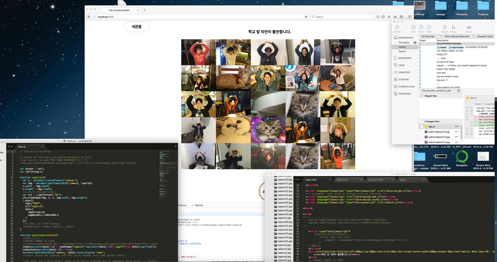

# webcamproject  
It was a freelance project for a student in Korea National University of Arts for the graduation project.  
The project was about a social experiment of sharing people's moments in the cafe through a webcam, to express the opinions about the area(mostly about safety in the area).  
The main goal was to develop in a very short amount of time(less than 1~2 weeks) to provide a minimum working prototype for the graduation project showcase.  
  
# Languages & Libraries used  
Web(HTML/CSS/JS)  
Web client side P5js  
Nodejs server on AWS Ubuntu 16.04 & Raspberry Pi  
Webcam server(motion)  
Local Python/Arduino code on raspberry pi to print real time screen captures from a receipt machine

# Screenshot
## Apologies about the poor quality of screenshot, it comes from a facebook post where the screenshot was taken spontaneously without the intention to properly show the working example.

